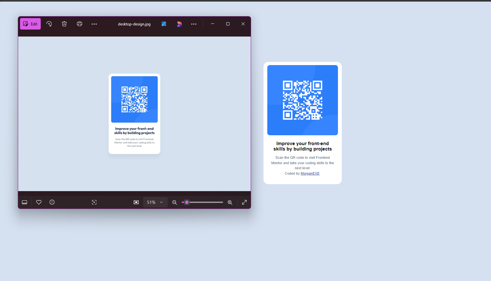

# Frontend Mentor - QR code component solution

This is a solution to the [QR code component challenge on Frontend Mentor](https://www.frontendmentor.io/challenges/qr-code-component-iux_sIO_H). Frontend Mentor challenges help you improve your coding skills by building realistic projects. 

## Table of contents

- [Overview](#overview)
  - [Screenshot](#screenshot)
  - [Links](#links)
- [My process](#my-process)
  - [Built with](#built-with)
  - [What I learned](#what-i-learned)
  - [Continued development](#continued-development)
- [Author](#author)
- [Acknowledgments](#acknowledgments)

## Overview

### Screenshot



### Links

- Solution URL: [Add solution URL here](https://your-solution-url.com)
- Live Site URL: [Add live site URL here](https://your-live-site-url.com)

## My process

### Built with

- Semantic HTML5 markup
- CSS custom properties

### What I learned

I refreshed my memory of how to work with the basics of HTML and CSS using classes within css to make changes to a specific div and how to properly align items with CSS

To see how you can add code snippets, see below:

```html
<h1>Some HTML code I'm proud of</h1>
```
to get the box aligned I did this
```css
.attribution {
      font-size: 15px;
    text-align: center;
    margin: auto;
    margin-top: 10%;
    width: 13%;
    padding-top: 10px;
    padding-bottom: 15px;
    border-radius: 15px;
    background-color: hsl(0, 0%, 100%);
    display: flex;
    flex-direction: column;
    justify-content: center;
    align-items: center;
    text-align: center;
    }
```


### Continued development

I want to refresh myself on responsiveness with CSS to make a mobile layout.


## Author

- Website - [Morgan Walker](https://github.com/MorganDWalker)
- Frontend Mentor - [@MorganDWalker](https://www.frontendmentor.io/profile/MorganDWalker)
